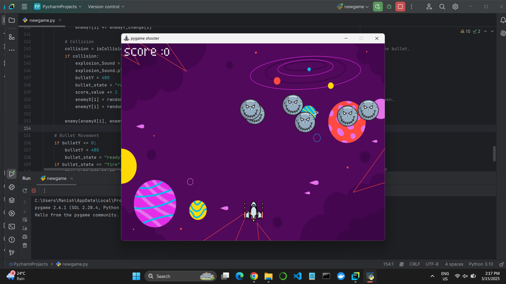
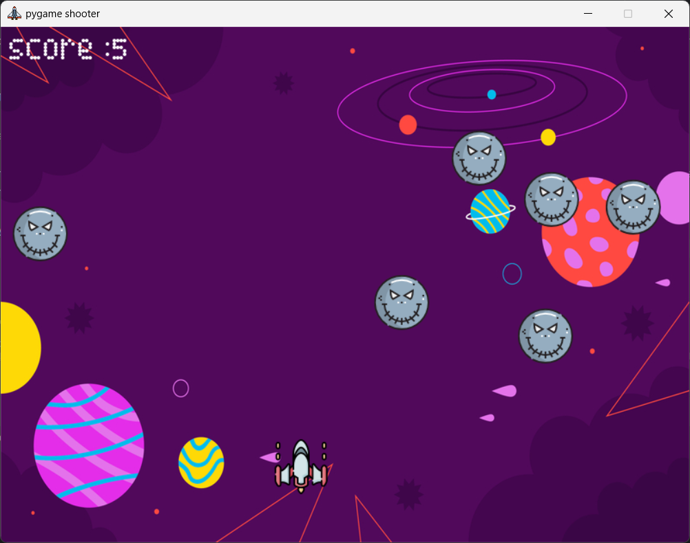
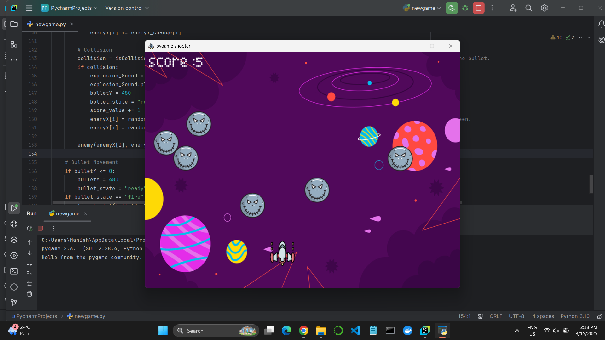
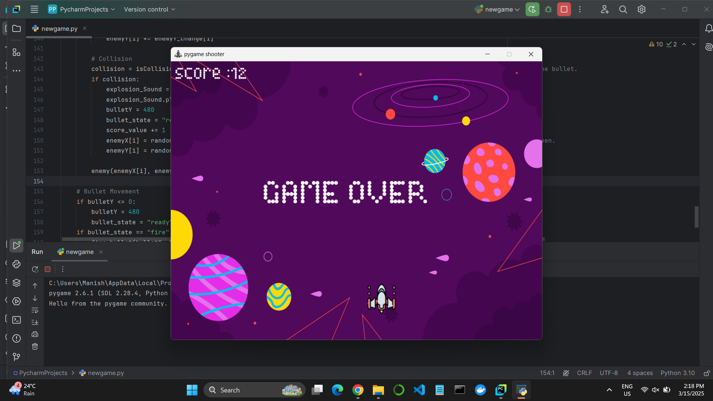

# 🎮 Shooterax

## 🚀 Overview

This is an exciting game built with Python and Pygame, designed to provide an immersive gaming experience with engaging mechanics and smooth gameplay. Whether you're a casual player or a competitive gamer, this game offers hours of fun.

## 📷 Demo / Screenshots

Here are some screenshots of the game in action:






## 🛠 Features

- ✅ Interactive and engaging gameplay

- ✅ Smooth animations and intuitive controls

- ✅ Multiple levels with increasing difficulty

- ✅ Power-ups and challenges to enhance the experience

- ✅ Customizable settings and leaderboard system

## 🏗 Tech Stack

Programming Language: Python
Frameworks: Pygame
Tools: GitHub, PyCharm

## 🎬 Installation & Usage
```
git clone https://github.com/Manishkatel/Shooterax.git
pip install pygame
python main.py

```


<p align="center"> <b>ENJOY THE GAME! 🎮🚀<b> </p> 

